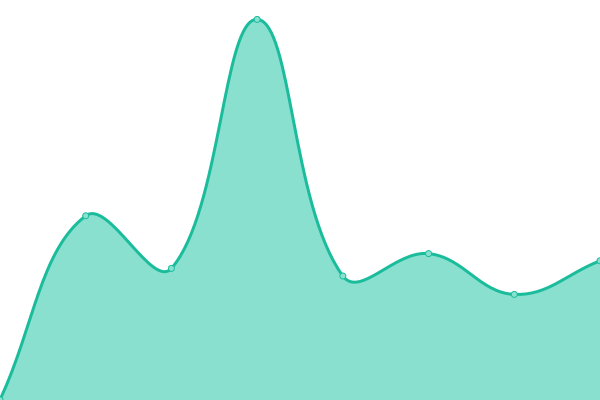
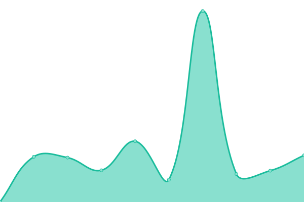

  

<h1 align="center">Atelier YO — Status</h1>

  Uptime monitoring & incident history for <a href="https://atelier-yo.fr"><b>atelier-yo.fr</b></a> 
  Powered by Upptime (GitHub Actions + Pages)

  <a href="https://N3uralCreativity.github.io/upptime"><b>View Status Page</b></a>
  ·
  <a href="https://atelier-yo.fr"><b>Main Website</b></a>
  ·
  <a href="https://github.com/N3uralCreativity/upptime/issues"><b>Incidents</b></a>

  
  
  

---

## Live status

# [📈 Live Status](https://N3uralCreativity.github.io/upptime): <!--live status--> **🟩 All systems operational**

This repository is automatically updated by Upptime.

- **Incidents:** GitHub Issues
- **Checks:** GitHub Actions
- **Public status page:** GitHub Pages

---

## Monitored services

> The table below is generated automatically. Don’t edit inside the markers.

<!--start: status pages-->
<!-- This summary is generated by Upptime (https://github.com/upptime/upptime) -->
<!-- Do not edit this manually, your changes will be overwritten -->
<!-- prettier-ignore -->
| URL | Status | History | Response Time | Uptime |
| --- | ------ | ------- | ------------- | ------ |
|  [Atelier YO](https://atelier-yo.fr) | 🟩 Up | [atelier-yo.yml](https://github.com/N3uralCreativity/upptime/commits/HEAD/history/atelier-yo.yml) | 

 552ms
     
 | 

<a href="https://status.atelier-yo.fr/history/atelier-yo">100.00%</a>
    

|  [Atelier YO (www)](https://www.atelier-yo.fr) | 🟩 Up | [atelier-yo-www.yml](https://github.com/N3uralCreativity/upptime/commits/HEAD/history/atelier-yo-www.yml) | 

 560ms
     
 | 

<a href="https://status.atelier-yo.fr/history/atelier-yo-www">100.00%</a>
    

<!--end: status pages-->

---

## About

- Repo owner: **N3uralCreativity**
- Site: **atelier-yo.fr**
- Status page: https://N3uralCreativity.github.io/upptime

## License

MIT — Upptime by Anand Chowdhary.
